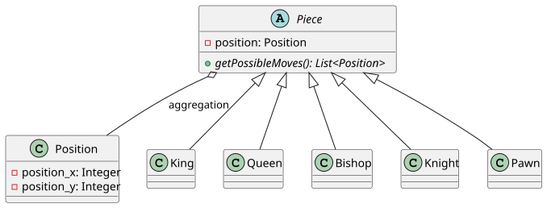
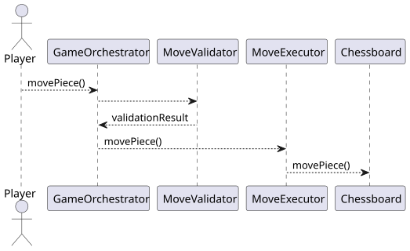
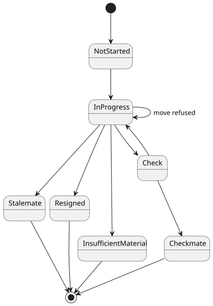
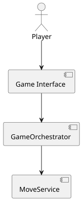

# Chess game in Java

## Goal :

Develop a chess game with main goal to step up 
in OOP and also to learn how chess works. 

#### Why chess game ?  
Chess game is a project where usage of multiple OOP concepts
is really necessary and easy to understand. This is a good example.

## Areas of learning : 

- Inheritance
- Polymorphism
- Encapsulation
- Abstraction
- SOLID

## Approach :

Starting with a light UML conception phase, before
implementing. Diagram will grow or change during coding.

## Diagrams :

### class-diagram

### sequence-diagram

### state-diagram

### component-diagram

## State :

In development 

## Technologies :

- Java 25
- Maven
- Maven Plugin PlantUML